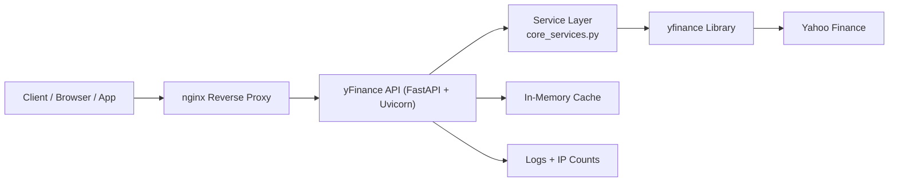

# yFinance Self-Hosted API Server 

This project provides a lightweight, self-hosted REST API for the `yfinance` Python library. It is designed to run as a robust `systemd` service on Ubuntu, featuring:
- request caching, 
- IP-based request counting, and 
- modular codebase.

To install and run in production environment see the [installation-and-setup-production](installation-and-setup-production.md) instructions.

---
## Table of Contents
- [Quick Start Guide](#quick-start-guide)
- [API Endpoints](#api-endpoints)
- [Architecture](#architecture)
- [Contributing](#contributing)
- [License](#license)
---

## Quick Start Guide
To run the API server locally for testing, execute the following commands:

```bash
# Clone the repository
git clone https://github.com/GP-software-engineering/yFinance-api
cd yfinance-api

# Create virtual environment and install dependencies
python3 -m venv venv
source venv/bin/activate

# Either install from 'requirements' or install packages explicitly:
# 
# uncomment this for installing from requirements
# pip install -r requirements.txt
#
pip install fastapi "uvicorn[standard]" yfinance cachetools json5

# Start the server
uvicorn api_server:app --host 0.0.0.0 --port 5000
```

Access the API at: `http://127.0.0.1:5000`

To install and run in production environment see the [installation-and-setup-production](installation-and-setup-production.md) instructions.

---

## API Endpoints

Base URL: `http://[SERVER_IP]:[PORT]`

#### Health Check

	GET /

Description: Checks if the API server is online.

Example:

    curl [http://127.0.0.1:5000/](http://127.0.0.1:5000/)

#### Ticker Info

    GET /ticker/{ticker_symbol}/info

Description: Returns the main .info dictionary for a ticker, containing profile, summary, and market data.

Example:

    curl [http://127.0.0.1:5000/ticker/AAPL/info](http://127.0.0.1:5000/ticker/AAPL/info)

#### Ticker History

    GET /ticker/{ticker_symbol}/history

Description: Returns historical OHLCV (Open, High, Low, Close, Volume) data.

Query Parameters:

- `period` (default: 1mo): 1d, 5d, 1mo, 3mo, 6mo, 1y, 2y, 5y, 10y, ytd, max
- `interval` (default: 1d): 1m, 2m, 5m, 15m, 30m, 60m, 90m, 1h, 1d, 5d, 1wk, 1mo, 3mo

Example:

    curl "[http://127.0.0.1:5000/ticker/MSFT/history?period=1y&interval=1wk](http://127.0.0.1:5000/ticker/MSFT/history?period=1y&interval=1wk)"

#### Dividends

    GET /ticker/{ticker_symbol}/dividends

Description: Returns a list of historical dividend payments.

Example:

    curl [http://127.0.0.1:5000/ticker/KO/dividends](http://127.0.0.1:5000/ticker/KO/dividends)

#### Splits

    GET /ticker/{ticker_symbol}/splits

Description: Returns a list of historical stock splits.

Example:

    curl [http://127.0.0.1:5000/ticker/TSLA/splits](http://127.0.0.1:5000/ticker/TSLA/splits)

#### Recommendations

    GET /ticker/{ticker_symbol}/recommendations

Description: Returns historical analyst recommendations.

Example:

    curl http://127.0.0.1:5000/ticker/NVDA/recommendations

#### Calendar

    GET /ticker/{ticker_symbol}/calendar

Description: Returns a dictionary of upcoming events, such as earnings dates.

Example:

    curl [http://127.0.0.1:5000/ticker/GOOGL/calendar](http://127.0.0.1:5000/ticker/GOOGL/calendar)

## Architecture
Below is a high-level architecture diagram of the service and its main components.



**Notes**
- **FastAPI + Uvicorn** serves the REST endpoints.
- **Cache** (TTL-based) reduces repeated upstream calls.
- **Logging & IP counting** are persisted under `/var/log/yfinance-api/`.
- **nginx** optionally fronts the service for TLS, buffering and standard ports (80/443).

## Contributing
We welcome contributions! To contribute:

1. Fork the repository.
2. Create a new branch for your feature or fix: `git checkout -b feat/awesome-thing`.
3. Commit with conventional messages (e.g., `feat: add cache metrics`).
4. Ensure code follows PEP 8 and is formatted with `black` / `ruff`.
5. Add or update tests where applicable.
6. Open a Pull Request describing the change and rationale.

### Development Setup

```bash
python3 -m venv .venv
source .venv/bin/activate
pip install -U pip
pip install -r requirements-dev.txt
pre-commit install
pytest -q
```

---

## License
MIT License Copyright (c) 2025 GP software engineering (by gpcaretti)
